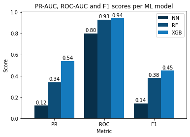
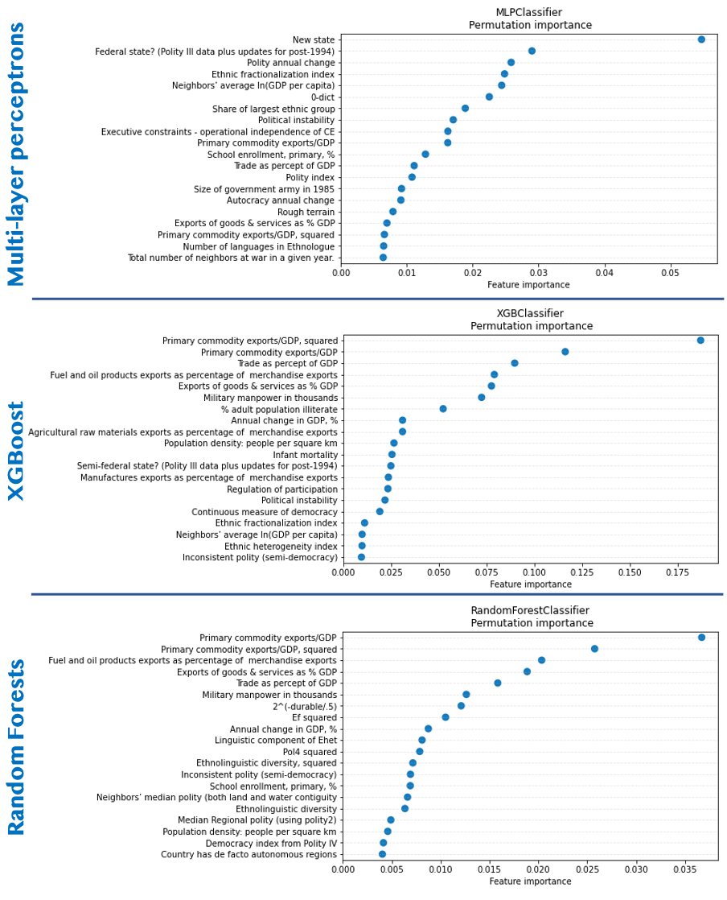
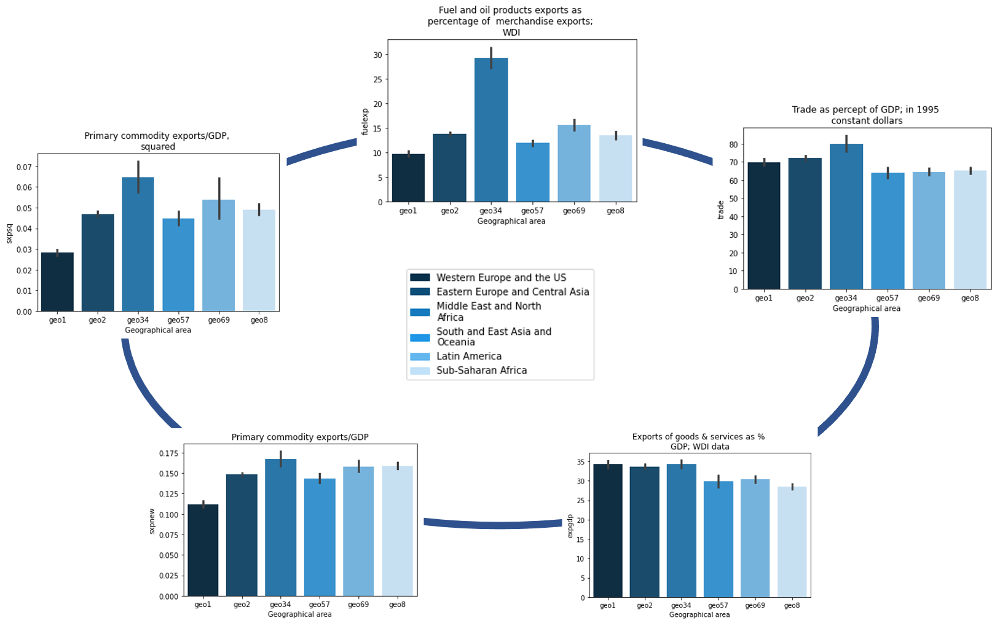
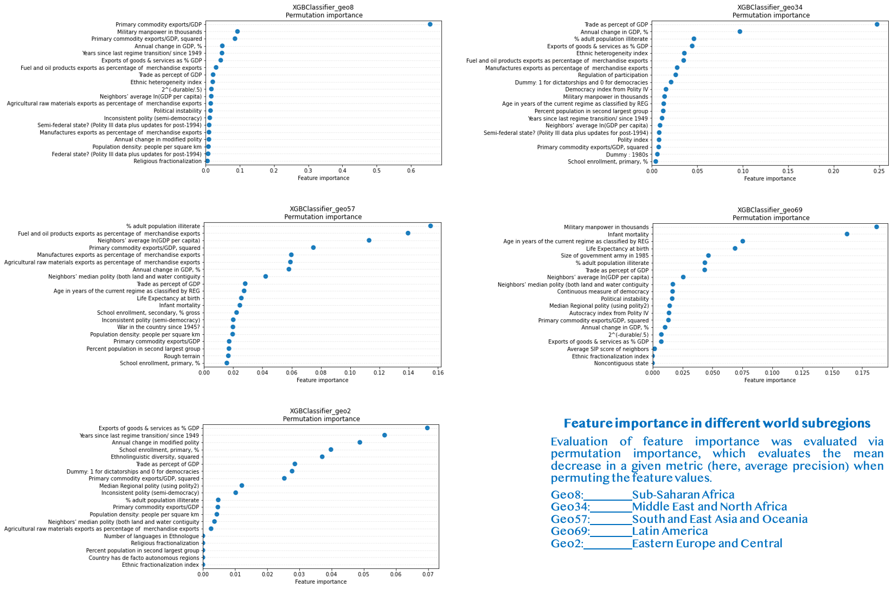
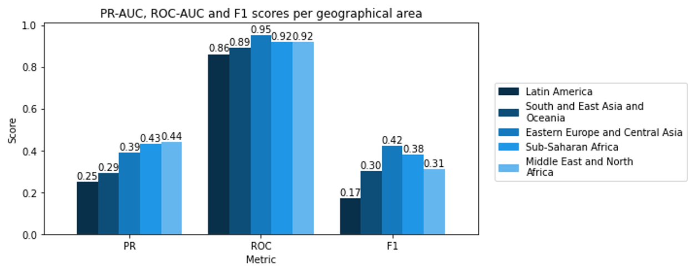

* TOC {:toc}
n°2
{:toc}

# What's at stake
A civil war is defined as a conflict between different groups of a single state or country. Such wars can have serious repercussions like resources´ consumption, crowd movement, or destruction of infrastructures. Besides, most of these conflicts imply international intervention -they represented two thirds of the 138 intrastate conflicts between the end of World War II and 2000 [[1]](#1). Thereby, understanding the dynamics leading to these rare events happens to be crucial. It would allow to anticipate and even to prevent civil wars in the years to come.  

# What has already been done to predict civil war onset 
Recent advancements in data science have catalyzed the development of predictive models for various problems, including political conflicts such as civil wars [[2]](#2) [[3]](#3) [[4]](#4). In 2015, Muchlinski _et al._ published a paper _Comparing Random Forest with Logistic Regression for Predicting Class-Imbalanced Civil War Onset Data_. They used Random Forests to try predicting rare events in conflict data more accurately. 
In this project, we first aim at benchmarking these results against other common machine learning algorithms, namely neural networks and gradient boosted trees. As the geographical area was an important feature in the abovementioned study ("Western Europe and US Dummy" in Fig. 4 [[5]](#5)), we will examine whether predictions differ when training separate models for each continent or subregion. Finally, we will explore whether civil war events can be forecast as time series instead of simple regression points, e.g., using autoregressive models.

# Zoom in on the dataset, Civil War Data
The Civil War Data gathers annual measurements of many features for each recognized country in the world from 1945 to 2000 [[4]](#4). 

The predictive variables notably include the type of government of the country, ethnic, linguistics, and religious indices, importation and exportation information, infant mortality, the rate of illiteracy, life expectancy, the situation in neighboring countries, topology and geographical information. 

As for the dependent variable, it consists in a binary measure indicating whether a civil war onset occurred for a given country in a given year. 

# Stretching the limits of previous analysis 
## Data wrangling
Before diving into the analysis, we first cleaned and organized the dataset. The latter is in civil war data (CWD), which consists in many features measured annually for each recognized country in the world from 1945 to 2000 [[4]](#4). We loaded the 88 variables indicated by Muchlinski et al. [5] together with the response variable (1 if a civil war event occured in a given country-year, 0 otherwise) and columns with country-year information, and cleaned the resulting dataset for the rest of the notebook.
A necessary cleaning step for our analysis was to correct the geographical dummy variables. These variables describe whether a country is in a given geographical area or not. For the data of the year 2000, their values suddenly differed from the previous years. Therefore, we simply corrected them by imputing the same values as the previous year.
Once the dataset cleaned, we started the analysis.


## Comparing machine learning algorithms for civil war onset classification.
In this section, we used the same features than Muchlinski _et al._ [[5]](#5) minus the features related to geographical area separation (e.g., "Western Europe and US Dummy"). Indeed, we investigated the effect of data aggregation by continent/subregion in a subsequent analysis. To ensure a meaningful comparison, the same training and testing sets were used to assess each tested algorithm.

### Defining the models
Here, we benchmarked the results obtained by Muchlinski et al. [[5]](#5) with Random Forests against two other machine learning algorithms: multi-layer perceptrons and gradient boosted trees (XGBoost). 
* **Multi-layer perceptrons** is a class of feedforward artificial neural network (ANN). The idea is to have layers of 'neurons' connected to each other with weights adjusted during the learning process. The output of each neuron layer, which is computed by some non-linear function of the sum of its inputs, is transmitted to the next layer. This model is occasionnally used to create mathematical models by regression analysis. Classification being a particular case of regression when the response variable is categorical, itvappears that multi-layer perceptrons make good classifier algorithms. As we explore civil war onset classification, evaluate the performance of this model thus seems promising.
* **XGBoost** uses decision trees to produce a prediction model. It is a a machine learning technique for regression and classification problems. Such an algorithm is usually used to learn to rank. Thus, since this part of the project consists in ranking the parameters that best indicate the probability of a civil war onset in a given country, using XGBoost could prove to be interesting.

### Evaluating the performance of the models
For each model, we performed hyperparameter optimization through cross-validated grid-search. Model performance was then evaluated on 15% of the dataset using three metrics: ROC-AUC and F1 scores as in Muchlinski et al. [[5]](#5), and also the area under the precision-recall curve (PR-AUC). Although normally suited for binary classification, the receiver operating characteristic (ROC) curve (Sensitivity vs. 1 - Specificity) is less informative for imbalanced problems with a few positive examples [[6]](#6). Indeed, while recall is equivalent to sensitivity, specificity cannot capture data skew as well as precision.
2 hyperparameters were tuned for each model:
We tuned 2 hyperparameters for each model:
 * **Random Forests**:
     * _max_features_: the number of features to consider to build the tree splits, namely either  or , with  the number of features.
     * _max_samples_: the number of samples to draw from the feature matrix to build each tree, namely either two-thirds or the entirety of the _N_ samples
  
 * **XGBoost**:
     * _max_depth_: maximum depth of a tree, namely either 3, 6 (default) or 9
     * _subsample_: the number of samples to draw from the feature matrix to build each tree, namely either two-thirds or the entirety of the _N_ samples
  
 * **Multi-layer perceptron**:
     * _alpha_: the amount of  regularization
     * _hidden_layer_sizes_: the number of hidden layers, namely either 4 or 8 (the width of the hidden layers was set to the number of features)

As the data is heavily imbalanced (approximate positive-negative ratio = 1:100), downsampling of the majority class was performed. The sampling strategy was also optimized through grid search as different positive-negative ratios were explored (1:7, 1:3 and 1:1).

### Result analysis 

Looking at the ROC-AUC results, it seems that the implemented multi-layer perceptron (MLP) performed worse than tree-based methods, as both Random Forests and XGBoost achieved similar scores.
That said, F1 and PR-AUC scores tell a different story with respect to Random Forests' predictive ability. Looking at these metrics, it seems XGBoost was far more robust at predicting civil events than Random Forest. The confusion matrices plotted above confirm this observation, as XGBoost was able to correctly classify 15 out of 20 civil war events, while Random Forests and MLP respectively predicted 9 and 5 civil war events.
Concerning the tree-based methods, these observations are in accord with corrections of Muchlinski et al. [[5]](#5)'s findings by Wang [[7]](#7), who found a substantial difference in PR-AUC between Random Forests and gradient boosted trees (such as XGBoost) on a similar dataset.
Overall, XGBoost was the best model for this task. In addition to its sheer rapidity, this algorithm has become increasingly popular for its performance in a variety of machine learning challenges [[8]](#8)[[9]](#9).

  <p align="center">
   
  </p>

***Figure 1.*** _Comparison between PR, ROC and F1-scores of the three tested models (MLPs, XGBoost and Ranfom Forests)_

Feature importance was evaluated via **permutation importance**, which evaluates the mean decrease in a given metric (here, average precision) when permuting the feature values.
In the figures above, we observe that the tree-based decision methods (Random Forests and XGBoost) have similar feature importances. In particular, primary commodity export features, exports of goods and services, fuel exports, the relative amount of trade and the relative amount of military manpower are the top-6 features in both models.
Contrary to the mean decrease in Gini score, this method is robust to feature cardinality. Hence, it is not surprising to observe that some political indicators (e.g., the Polity index or a dummy variable describing whether the state is semi-federal) that were surprisingly absent in Muchlinski et al.'s model [5] are present in the most important features of Random Forests and XGBoost. In spite of this, both methods share a fair amount of important variables with those of Muchlinski et al.'s model [5] (e.g., primary commodity export features, trade, military power, infant mortality, illiteracy).
On the other hand, the multi-layer perceptron captures a lot more political indicators in its most important features, the top-3 features concern the "political structure" of the country (1. Whether it is a new state or not, 2. whether it is a federal state or not, 3. Polity annual change). That said, the trade-related features that were critical in the tree-based models are also present in top 10-20 features of the MLP.

  
  ***Figure 2.** Permutation importances and the confusion matrices of the three tested models (MLPs, XGBoost and Ranfom Forests)*

## Effect of spatial data separation
Following the importance of the "Western Europe and US Dummy" variable in Muchlinski _et al._ [[5]](#5), we decided to aggregate the data by subregions, and to see whether predictive accuracy differs when fitting the models separately on each group. We then analyzed feature importance to see whether different variables can explain better civil war events in different geographical areas.
Thus, in this step, we explore whether spatial separation of civil war data (i.e., by continent or subregion) can help improve predictive accuracy of civil war events. To do so, we split the datasets according to the dummy variables, and fit a XGBoost classifier for each subset. Once again, cross-validated grid-search is used to optimize hyperparameters using the training set before evaluation on the test set.

One limit of this analysis is that only one civil war event was reported in Western Europe and US (The Troubles in Northern Ireland (1969)) (among 1157 country-years). This is especially problematic as only the train set or the test set could have a positive example. Thus, we decided to ignore this subset. With that in mind, we decided to discard this region from this part. On top of this machine learning-driven explanation, this decision is also motivated when looking at economic, social and political indicators. In particular, we selected the five most important features from XGBoost in the previous section, and compared bootstrapped 95% confidence intervals around the mean of these features for each geographical area. We can see that some of the variables are substantially different for Western Europe and US countries, especially primary commodity and fuel exports.


<p align="center">
 
</p>

***Figure 3.*** _Comparison of the parameters that best explained the probability for a civil war onset for different world subregions_

After discarding Western Europe & US data, we fitted XGBoost on each of them using the same procedure as in the first section.

<p align="center">
 
</p>

***Figure 4.*** _Permutation importances for different subregions_

<p align="center">
 
</p>

***Figure 5.*** _PR-AUC, ROC-AUC and F1-scores for different subregions_


  * After data separation by geographical area, the results datasets are much smaller. As a consequence, the testing sets only contain a handful of positive examples (1 to 5). Thus, we decided to evaluate PR-AUC, ROC-AUC and F1 scores over 5 different train-test splits to minimize "lucky" or "unlucky" examples in the test sets.
 
 * The results for Sub-Saharan Africa, Middle East and North Africa and Eastern Europe and Central Asia are somewhat similar to the performance of XGBoost in Step 1 on the whole dataset, especially when looking at ROC-AUC and F1 scores. On the other hand, the PR-AUC scores are slightly lower (0.45-0.5) than observed in Step 1 (0.54).
 
 * The classifiers of civil war events in Latin America and South and East Asia and Oceania performed much worse. For the latter, PR-AUC, ROC-AUC and F1 values resemble the ones obtained when training the multi-layer perceptron in Step 1.
 
 * Interestingly, the important predictors of civil war onset differed staggeringly over the different geographical areas:
      * In **Eastern Europe and Central Asia**, the three most important features were "Exports of goods & servies as % of GDP", "Years since last regime transition since 1949" and "Annual change in modified polity". The last two variables echo with the fact many countries in these areas were either under the Soviet yoke (e.g., Romania, Afghanistan), and/or also governed by authoritarian regimes nowadays (e.g., Tajikistan, Kazakhstan)
      * In **Middle East and North Africa (MENA)**, two trade-related features stood out: "Trade as % of GDP" and "% Annual change in GDP". This observation is consistent with the previous feature bar plots as MENA had the highest country-averaged trade-to-GDP ratio. One can also notice the importance of fuel and oil exports (4th), which are vital to the economy of numerous countries in this region (Saudi Arabia, Iraq, and UAE are among the top-5 countries in terms of crude oil exports [11]).
      * In **South and East Asia and Oceania**, the three most important features were "% adult population illiterate", "Fuel and oil product exports as % of merchandise exports" and "neighbors' average ln(GDP per capita)". Although not visible in the bar plot, the fact that fuel-related variables are important is consistent with the importance of coal in this region. For instance, China and Indonesia are among the top-5 countries in terms of coal exports [12], and were impacted by several civil war events in the 20th century (China: Chinese Civil-War (1945-1949), Indonesia: Papua conflict since 1962). As a rapidly developing region during the second half of the century, it is possible that literacy rates and GDP per capita measurements somehow correlated with civil war onset as most of which occurred soon after the Second World War.
      * In **Latin America**, military manpower and children mortality were staggeringly more important than the other variables. The first feature heavily contrasts with feature importances in the other regions. A possible explanation for this feature is the fact that military institutions were often deeply intertwined with political affairs in Latin American countries (e.g., Costa Rican Civil War (1948), Salvdaron Civil War (1979-1992)) [13]. 
      * In **Subsaharan Africa**, primary commodity exports/GDP was by far the most critical variable. This results is somewhat consistent with previous analyses by Collier and Hoeffler who found that a high percent of primary commodity exports as a function of GDP was a strong risk factor of civil war onset in Africa [3,14].

 
 * All the same, it seems that geographical area separation did not help better classify civil war events. A possible reason for such results would be that the classifiers were trained with less data, and had thus less generalizing abilities. 

 * While possibly contradicting with the results of Muchlinski et al. [5], who found that the US and Western Europe Dummy was an important feature of their Random Forests, this result seems coherent when looking at the mutual information between the different features and the response variable. Indeed, some geographical dummy variables (e.g., geo2 and geo57) are among the variables with the least mutual information with the response variable, meaning that they contain close to no information about civil war onset.

## Predicting civil war onset as time series forecasting
In this section, we considered that each subregion is assigned to a time series of civil war/peace events. This part of the project aimed at seeing whether civil war events could be forecast given past data using simple time forecasting models (e.g., autogressors (AR) or ARIMA). 


## References
<a id="1">[1]</a> Civil Wars and Foreign Powers: Outside Intervention in Intrastate Conflict. By Patrick M. Regan. Ann Arbor: University of Michigan Press, 2000.

<a id="2">[2]</a> Fearon, J. D., & Laitin, D. D. (2003). Ethnicity, insurgency, and civil war. _American political science review_, 75-90.

<a id="3">[3]</a> Collier, P., & Hoeffler, A. (2004). Greed and grievance in civil war. _Oxford economic papers_, 56(4), 563-595.

<a id="4">[4]</a> Hegre, H., & Sambanis, N. (2006). Sensitivity analysis of empirical results on civil war onset. _Journal of conflict resolution_, 50(4), 508-535.

<a id="5">[5]</a> Muchlinski, D., Siroky, D., He, J., & Kocher, M. (2016). Comparing random forest with logistic regression for predicting class-imbalanced civil war onset data. _Political Analysis_, 87-103.

<a id="6">[6]</a>  Davis, J., & Goadrich, M. (2006). The relationship between Precision-Recall and ROC curves. In Proceedings of the 23rd international conference on Machine learning (pp. 233-240).

<a id="7">[7]</a> Wang, Y. (2019). Comparing random forest with logistic regression for predicting class-imbalanced civil war onset data: A comment. Political Analysis, 27(1), 107-110.

<a id="8">[8]</a> Chen, T., & He, T. (2015). Higgs boson discovery with boosted trees. In NIPS 2014 workshop on high-energy physics and machine learning (pp. 69-80).

<a id="9">[9]</a> Ismailov, A. (2019). Humor Analysis Based on Human Annotation Challenge at IberLEF 2019: First-place Solution. In IberLEF@ SEPLN (pp. 160-164).

## Welcome to GitHub Pages

You can use the [editor on GitHub](https://github.com/Neclow/ada-2020-project-milestone-p3-p3_navaja/edit/gh-pages/index.md) to maintain and preview the content for your website in Markdown files.

Whenever you commit to this repository, GitHub Pages will run [Jekyll](https://jekyllrb.com/) to rebuild the pages in your site, from the content in your Markdown files.

### Markdown

Markdown is a lightweight and easy-to-use syntax for styling your writing. It includes conventions for

```markdown
Syntax highlighted code block

# Header 1
## Header 2
### Header 3

- Bulleted
- List

1. Numbered
2. List

**Bold** and _Italic_ and `Code` text

[Link](url) and 
```

For more details see [GitHub Flavored Markdown](https://guides.github.com/features/mastering-markdown/).

### Jekyll Themes

Your Pages site will use the layout and styles from the Jekyll theme you have selected in your [repository settings](https://github.com/Neclow/ada-2020-project-milestone-p3-p3_navaja/settings). The name of this theme is saved in the Jekyll `_config.yml` configuration file.

### Support or Contact

Having trouble with Pages? Check out our [documentation](https://docs.github.com/categories/github-pages-basics/) or [contact support](https://github.com/contact) and we’ll help you sort it out.
