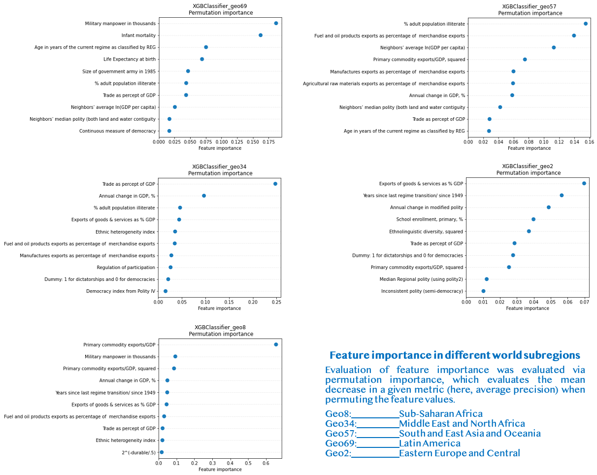

In this project, we analyzed different methods to classify and predict civil war onset. First, we compared different machine learning algorithms to state-of-the-art results. Then, we explored whether these events could be better predicted with a specific model for given geographical areas and if they could forecast from past data (instead of a "simple" binary classification problem).

* TOC {:toc}
n°2
{:toc}

# What's at stake?
In the wake of World War II, the world has seen a steady increase in **civil wars** [[1]](#1), often with dire consequences for the affected states. Thereby, understanding the underlying dynamics of such conflicts has become a burning topic for data scientists. Indeed, being able to predict civil war onset could be crucial in allow to anticipate or prevent these devastating events.

# What has been done?
Recent advancements in data science have catalyzed the development of predictive models for various problems, including political conflicts such as civil wars [[2]](#2) [[3]](#3) [[4]](#4). Despite multiple design errors in their study, Muchlinski _et al._  [[5]](#5)) significantly improved civil war onset prediction using **Random Forests** (RFs), a decision tree-based machine learning algorithm. In this project, we extended the latter findings by investigating the following questions:

 * How does Muchlinski et al.'s model compare with other popular ML algorithms?
 * How does civil war prediction vary when training separate models for geographically-split datasets?
 * Can civil war onset prediction be performed as a time-series forecasting problem?

# About the dataset
The Civil War Data comprises annual measurements for each recognized country from 1945 to 2000 [[4]](#4). These notably include features about:
 * **Politics**: type of government, democracy indices...
 * **Economy**: GDP growth and per capita, 
 * **Socio-cultural development**: literacy rate, life expectancy, religious diversity indices... 
 * **Geography**: in which region the country is located, how rough is its terrain
In total, our dataset has **7140** "country-years",  **88** features and **1** response variable, which consists in a binary indicator of civil war onset (1 = civil war, 0 otherwise). Importantly, the data is heavily imbalanced, as civil war onset approximately occurred **1%** of the time! 
 
# Analysis 1: Comparing machine learning algorithms for civil war onset classification
As mentioned previously, Muchlinski et al. [[5]](#5) achieved groundbreaking results with this dataset using **Random Forests**. In this section, we benchmarked these results against two widely used ML algorithms: **multi-layer perceptrons** (MLPs) and **XGBoost**, an _extreme_ gradient boosted tree-based model. As we intend to study geographical separation later, we will here work without the 6 location-related variables.

## Quick recap: of artificial neurons and (boosted) trees
* As the name suggests, **Multi-layer perceptrons** are feedforward articifial neural networks with one or several _hidden_ layers between an *input* layer and an *output* layer. The use of hidden layers make neural networks very powerful, as they can solve problems that are not linearly separable.

* **Random Forests** (RFs) and **XGBoost** both use collections of _decision trees_ to perform predictions. They can be viewed as crowdsourcing  algorithms, as they combine the results of weak trees to make _oak-solid_ predictions.

* On top of that, **XGBoost** relies on *gradient boosting*: here, the trees are trained <u>sequentially</u> instead of <u>independently</u> (like in RFs). In addition to its sheer rapidity, this algorithm has become increasingly popular for its performance in a variety of machine learning challenges [[6]](#6)[[7]](#7).

  

   
   <i><b>Figure 1.</b>Diagram of mutli-layer perceptrons (MLPs), Random Forests (RFs) and XGBoost</i>
  

## Training & Testing
To ensure a fair comparison, we compared the three algorithms with the same datasets: **85%** of the data in the training set, and **15%** in the test set.

Using the training set, we performed hyperparameter optimization through **grid search** combined with **10-fold cross-validation**. To face data imbalanced, **downsampling** was performed, where the sampling strategy was also optimized through grid search.

Using the test set, we evaluated model performance using three metrics:

 * The area under the **ROC** curve (*sensitivity* vs. *1-specificity*)
 * The **F1** score, the harmonic mean of *precision* and *recall* (or sensitivity)
 * The area under the **Precision-recall** (PR) curve

Note that the two latter metrics are more suited for imbalanced problems, as _specificity_ cannot capture data skew as well as _precision_.

## Results
Looking at the ROC-AUC results, it seems that MLP performed the worst, while Random Forests and XGBoost achieved similar scores.

That said, F1 and PR-AUC scores tell us a different story. Indeed, **XGBoost** (PR-AUC: 0.54, F1: 0.45) was far more robust at predicting civil war events than Random Forests (PR-AUC: 0.34, F1: 0.38). Once again, MLPs were at the bottom of the ladder.

**Overall rankings: 1. XGBoost, 2. RF, 3. MLP**

Thus, it seems that Muchlinski et al.'s [[5]](#5) results could be improved by extremely boosting the trees.

  

   
  

  
 
  <i><b> Figure 2. </b>PR-AUC, ROC and F1-scores of the three tested models (MLPs, XGBoost and Ranfom Forests) </i> 

## Opening the black box
Classification results are one thing, but _how_ did our models classify civil war events?

For that, we analyzed feature importance via **permutation importance**, which denotes the mean decrease in a given metric (here, PR-AUC) when randomly permuting the feature values. Contrary to the **mean decrease in Gini score**, this method is robust to feature cardinality.

Here, we can see that the tree-based decision methods (Random Forests and XGBoost) had similar feature importances. In particular, primary commodity export features, exports of goods and services, fuel exports, trade-to-GDP ratio and the relative amount of military manpower are the top-6 features in both models.

On the other hand, the MLP captured a lot more political indicators in its most important features, as the top-3 deals with political structure (1. Whether it is a new state or not, 2. whether it is a federal state or not, 3. Polity annual change). Importantly, the trade-related features that were critical in the tree-based models are also present in top 10-20 features of the MLP. 

  
  

   <i><b> Figure 3. </b> Top-20 features in terms of permutation importance for MLP, XGBoost and Random Forests</i>
  

    
# Analysis 2: Predicting civil war in different geographical areas
Following the importance of the "Western Europe and US Dummy" variable in Muchlinski _et al._ [[5]](#5), we decided to aggregate the data by different subregions and to see whether predictive accuracy differs when fitting the models separately on each group.

In particular, the following geoscheme was used:
* Western Europe and US
* Eastern Europe and Central Asia (EECA)
* Middle East and North Africa (MENA)
* South and Eastern Asia and Oceania
* Latin America
* Subsaharan Africa

One limit of this analysis is that only one civil war event was reported in Western Europe and US (The Troubles in Northern Ireland (1969)). This is especially problematic as only the train set or the test set could have a positive example. Thus, we decided to ignore this subset.

With that in mind, we re-used **XGBoost** for the remaining geographical areas and followed the same procedure as in the first analysis, _but with a twist_. As the testing sets only contain a handful of positive examples (typically 1 to 5), we decided to evaluate model performance over <u>10</u> different train-test splits to minimize "lucky" or "unlucky" training-test splits.

<i><b>Figure 4.</b> Top-10 features in terms of permutation importance for XGBoost, trained on different geographical areas</i>

<i><b>Figure 5.</b> PR-AUC, ROC-AUC and F1-scores for XGBoost, trained on different geographical areas</i>

 
As seen in the figure below, results for Sub-Saharan Africa, MENA and EECA are somewhat similar to the performance of XGBoost in the first problem, especially regarding ROC-AUC and F1 scores. On the other hand, the PR-AUC scores are slightly lower (0.45-0.5 vs. 0.54 previously).
 
Sadly, the classifiers of civil war events in Latin America and South and East Asia and Oceania performed much worse. For the latter area, PR-AUC, ROC-AUC and F1 values resemble MLP performance in Step 1.
 
Beyond that, an interesting result was that feature importance differed staggeringly over the different geographical areas:

* In **EECA**, the importance of **"Years since last regime transition since 1949"** an **"Annual change in modified polity"** echo with the fact that many countries in this zone were either under the Soviet yoke (ex: **Romania**), and/or governed by long-lasting authoritarian regimes nowadays (ex: **Tajikistan**)

* In **MENA**, the importance of trade-related features (**"Trade as % of GDP"** and **"% Annual change in GDP"**) are consistent with the importance of trade in this region compared to other regions. One can also notice the importance of **fuel and oil exports** (4th), which are vital to the economy of numerous countries in this area (Saudi Arabia, Iraq, and UAE are among the top-5 countries in terms of crude oil exports [[8]](#8)).

* In **South and East Asia and Oceania**, the three most important features were **"% adult population illiterate"**, **"Fuel and oil product exports as % of merchandise exports"** and **"neighbors' average ln(GDP per capita)"**. The fact that fuel-related variables are important is consistent with the importance of coal in this region. For instance, China and Indonesia are among the top-5 countries in terms of coal exports [[9]](#9), and were impacted by several civil war events in the 20th century (China: Chinese Civil-War (1945-1949), Indonesia: Papua conflict since 1962).

* In **Latin America**, military manpower and children mortality were staggeringly more important than the other variables. Interestingly, the first feature is specifically high in this region. A possible explanation for this feature is the fact that military institutions were often deeply intertwined with political affairs in Latin American countries (e.g., Costa Rican Civil War (1948), Salvdaron Civil War (1979-1992)) [[10]](#10). 

* In **Subsaharan Africa**, primary commodity exports/GDP was by far the most critical variable. This results is somewhat consistent with previous analyses by Collier and Hoeffler who found that a high percent of primary commodity exports as a function of GDP was a strong risk factor of civil war onset in Africa [[3]](#3).
 
**Conclusion:** it seems that geographical area separation did not help better classify civil war events. A possible reason for such results would be that the classifiers were trained with less data, and had thus less generalizing abilities. 

# Analysis 3: Can civil war onset be forecast?
In this section, we will consider that each country is assigned to a time series of civil war/peace events, and see whether civil war events could be forecast given past data using simple time forecasting models.

Three common techniques are usually employed to study time series:

* **Recurrent neural networks** (RNNs) have become incresingly popular with the deep learning revolution, and have shown tremendous performance in speech recognition or machine translation. Nonetheless, such neural networks generally require a lot of data to be able to avoid overfitting and output robust predictions.
* **Autoregression** and **Hidden Markov Models** (HMMs) are also popular for analyzing time series data. To our best knowledge, they are however not well suited to forecast rare events such as civil war onset.

With that in mind, we decided to (once again) predict civil war onset with **XGBoost**, this time with _time-delayed features_. For each country  at year , we aim at classifying events at year  given features from previous years . 

## Preparing the dataset
For this task, we splitted the dataset for each country, and created sequences of  years for countries with more than  years of existence. In this project, we assumed that  years should be the maximal delay to explain civil war onset at a given year.

## Results

When looking at imbalance-robust metrics (PR-AUC and F1 scores), the best model seems to be obtained with , i.e. when only considering data from the previous year. A possible explanation for such a result is that most variables will tend to remain similar over a year, while greater change can be expected when considering older data.

  

   
  

  
<i><b>Figure 6.</b> PR-AUC, ROC-AUC and F1-scores for XGBoost, trained with time-delayed features</i>

Overall, these results remain arguably worse than during the two previous steps. In fairness, this problem is also conceptually harder. Indeed, many civil war events are not continuous processes, but rather tend to spark spontaneously. For instance, the Arab Spring suddenly triggered several uprisings in Syria, Libya and Egypt in 2011 [[11]](#11).

**Conclusion:** Time-series forecasting of civil war onset with this data was unsuccessful. Further research for this task could be performed with larger datasets to be able to harness the power of RNNs.

# References
<a id="1">[1]</a> Pettersson, T., & Öberg, M. (2020). Organized violence, 1989–2019. _Journal of peace research_, 57(4), 597-613. <a href="https://journals.sagepub.com/doi/pdf/10.1177/0022343320934986">link</a>

<a id="2">[2]</a> Fearon, J. D., & Laitin, D. D. (2003). Ethnicity, insurgency, and civil war. _American political science review_, 75-90. <a href="https://www.jstor.org/stable/pdf/3118222.pdf?casa_token=isFvLon_eKsAAAAA:8HeoXU8qmr5H9Jyos3suWc13q4e5dK0x3rPvQK4bsftKOP8BNNSi7JQ1DxKrPHWSvFuFUxK4mzn8Lx5HJ764eR8NHd7r1JZM4uYis5H19syajxOakOol">link</a>

<a id="3">[3]</a> Collier, P., & Hoeffler, A. (2004). Greed and grievance in civil war. _Oxford economic papers_, 56(4), 563-595. <a href="https://academic.oup.com/oep/article/56/4/563/2361902?casa_token=6Zt6w3v9HFsAAAAA:vM_vHN1WF0J1uphvdV3bJOLv-Q0JaMjXJyxAsFtJrxpHhhnvWT1cydX6HZ9qD8OSo9Bd7qJAz0mpig">link</a>

<a id="4">[4]</a> Hegre, H., & Sambanis, N. (2006). Sensitivity analysis of empirical results on civil war onset. _Journal of conflict resolution_, 50(4), 508-535. <a href="https://www.jstor.org/stable/pdf/27638504.pdf?casa_token=LScMjel1D9IAAAAA:TCzVGzpfc97TH08QnCoJcCOTxMiqN5CCdDvhZPIWOyqh5tnvXlUt2KC6Cc4h5sQxDeTyCj4BOP6dofhqu8XIjmlb_MAzohEYicQx-rsjjyEokrPkH7g-">link</a>

<a id="5">[5]</a> Muchlinski, D., Siroky, D., He, J., & Kocher, M. (2016). Comparing random forest with logistic regression for predicting class-imbalanced civil war onset data. _Political Analysis_, 87-103. <a href="http://davidsiroky.faculty.asu.edu/predictcivilwar.pdf">link</a>

<a id="6">[6]</a> Chen, T., & He, T. (2015). Higgs boson discovery with boosted trees. In _NIPS 2014 workshop on high-energy physics and machine learning_ (pp. 69-80). <a href="http://proceedings.mlr.press/v42/chen14.pdf">link</a>

<a id="7">[7]</a> Ismailov, A. (2019). Humor Analysis Based on Human Annotation Challenge at IberLEF 2019: First-place Solution. In _IberLEF@ SEPLN_ (pp. 160-164). <a href="http://ceur-ws.org/Vol-2421/HAHA_paper_3.pdf">link</a>

<a id="8">[8]</a> Central Intelligence Agency. (2018). The World Factbook - country comparison:: crude oil - exports. <a href="https://www.cia.gov/library/publications/the-world-factbook/rankorder/2242rank.html">link</a>

<a id="9">[9]</a> U.S. Energy Information Administration (EIA). (2018). Total energy production from coal 2018. <a href="https://www.eia.gov/international/rankings/country/CHN?pid=4411&aid=1&f=A&y=01%2F01%2F2018&u=0&v=none&pa=286">link</a> 

<a id="10">[10]</a> Encyclopædia Britannica. (2019). History of Latin America - Latin America since the mid-20th century. <a href="https://www.britannica.com/place/Latin-America/Latin-America-since-the-mid-20th-century">link</a> 

<a id="11">[11]</a> Henry, C., & Jang, J. H. (2013). _The Arab Spring: Will it Lead to Democratic Transitions?_ Springer.
